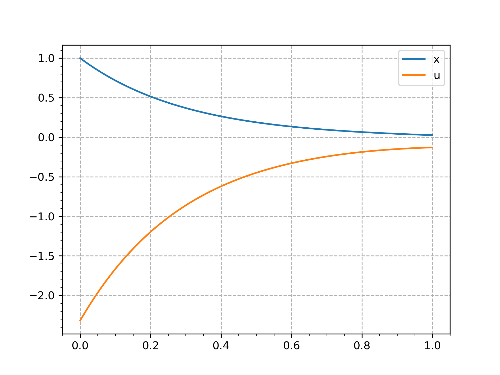

# pockit: Python Optimal Control KIT

**😃 Welcome to pockit's project page**

## Introduction

**Pockit** is a Python package that solves optimal control problems numerically. It utilizes advanced techniques to be powerful, easy to use, and fast.

- 💪 **Powerful:** Pockit can handle almost any optimal control problem. It employs a multiple-phase optimal control model that allows for continuous/non-continuous state and control variables, path/integral/boundary constraints, and fixed/free initial and terminal times.
- 🔢 **Easy to use:** Pockit is designed to be user-friendly. It provides a [SymPy](https://www.sympy.org/)-based, intuitive interface for defining and solving problems.
- ⚡ **Fast:** Pockit is fast. It uses various techniques to speed up the entire compilation and solution process, including symbolic differentiation (with [SymPy](https://www.sympy.org/)), Just-In-Time compilation (with [Numba](https://numba.pydata.org/)), vectorization, and more.

For more information, please visit the [documentation](http://pockit-docs.notion.site/) and [API reference](https://pockit-api.pages.dev/).

## LQR in 1 Minute
```python
from pockit.lobatto import System, constant_guess
from pockit.optimizer import ipopt
import matplotlib.pyplot as plt

# LQR problem:
# min ∫_0^1 (q * x^2 + r * u^2) dt + s * x_f^2 / 2
# s.t. x' = a * x + b * u, x(0) = 1

# Set parameters
a, b, s, q, r = -1, 1, 1, 1, 0.1

# Set up the system
# The system has one free parameter x_f
system = System(["x_f"])
x_f, = system.s  # extract the Sympy symbol x_f
# The phase has one state x and one control u
phase = system.new_phase(["x"], ["u"])
x, = phase.x  # extract the Sympy symbol x
u, = phase.u  # extract the Sympy symbol u
phase.set_dynamics([a * x + b * u])  # x' = a * x + b * u
# I = ∫ q * x^2 + r * u^2 dt
phase.set_integral([q * x ** 2 + r * u ** 2])
# x(0) = 1, x(t_f) = x_f, t_0 = 0, t_f = 1
phase.set_boundary_condition([1], [x_f], 0, 1)
# 10 subintervals with 10 collocation points in each subinterval
phase.set_discretization(10, 10)
system.set_phase([phase])  # bind the phase to the system
# define the objective function
system.set_objective(phase.I[0] + s * x_f ** 2 / 2)

# initial guess for the phase
guess = constant_guess(phase, 0)
# 0. is the initial guess for the free parameter x_f
# var_p: the optimal solution for the phase
# var_s: the optimal solution for the free parameter
[var_p, var_s], info = ipopt.solve(system, [guess, [0.]])

# Print the results
print("status:", info["status_msg"].decode())
print("objective:", info["obj_val"])  # 0.2319139744522318

# Plot the results
# only one state variable and one control variable, 
# so the indices are 0 for both
plt.plot(var_p.t_x, var_p.x[0], label="x")
plt.plot(var_p.t_u, var_p.u[0], label="u")
plt.legend()
plt.minorticks_on()
plt.grid(linestyle='--')
plt.show()
```


## Join the Community

Discord: [https://discord.gg/A47hj9x9F9](https://discord.gg/A47hj9x9F9)

## Support the Project

If you like pockit, please consider supporting the project by giving it a star on GitHub. It helps the project grow and reach more people. Thank you!

If you would like to sponsor the project or the author financially, please use the PayPal link: [https://www.paypal.com/paypalme/zouyilin](https://www.paypal.com/paypalme/zouyilin). Your support is greatly appreciated!